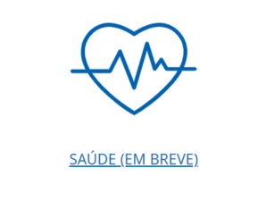
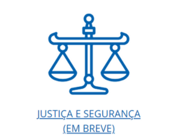
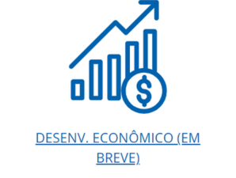
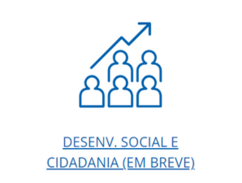
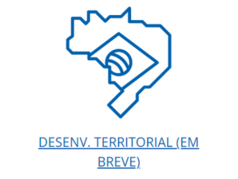
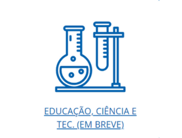

<!doctype html>
<html lang="en" data-bs-theme="auto">

<head>
  

  <meta charset="utf-8">
  <meta name="viewport" content="width=device-width, initial-scale=1">
  <meta name="description" content="">
  <meta name="author" content="Mark Otto, Jacob Thornton, and Bootstrap contributors">
  <meta name="generator" content="Hugo 0.122.0">
  <title>Serviços Distrito Federal </title> 
<!-- MUDOU O NOME NA BARRA DE navegação -->

  <link rel="canonical" href="https://getbootstrap.com/docs/5.3/examples/album/">

  <link rel="stylesheet" href="https://cdn.jsdelivr.net/npm/@docsearch/css@3">

  <link href="assets/dist/css/bootstrap.min.css" rel="stylesheet">

<link rel="stylesheet" href="style.css">

</head>

<body>
  <svg xmlns="http://www.w3.org/2000/svg" class="d-none">
    <symbol id="check2" viewBox="0 0 16 16">
      <path
        d="M13.854 3.646a.5.5 0 0 1 0 .708l-7 7a.5.5 0 0 1-.708 0l-3.5-3.5a.5.5 0 1 1 .708-.708L6.5 10.293l6.646-6.647a.5.5 0 0 1 .708 0z" />
    </symbol>
    <symbol id="circle-half" viewBox="0 0 16 16">
      <path d="M8 15A7 7 0 1 0 8 1v14zm0 1A8 8 0 1 1 8 0a8 8 0 0 1 0 16z" />
    </symbol>
    <symbol id="moon-stars-fill" viewBox="0 0 16 16">
      <path
        d="M6 .278a.768.768 0 0 1 .08.858 7.208 7.208 0 0 0-.878 3.46c0 4.021 3.278 7.277 7.318 7.277.527 0 1.04-.055 1.533-.16a.787.787 0 0 1 .81.316.733.733 0 0 1-.031.893A8.349 8.349 0 0 1 8.344 16C3.734 16 0 12.286 0 7.71 0 4.266 2.114 1.312 5.124.06A.752.752 0 0 1 6 .278z" />
      <path
        d="M10.794 3.148a.217.217 0 0 1 .412 0l.387 1.162c.173.518.579.924 1.097 1.097l1.162.387a.217.217 0 0 1 0 .412l-1.162.387a1.734 1.734 0 0 0-1.097 1.097l-.387 1.162a.217.217 0 0 1-.412 0l-.387-1.162A1.734 1.734 0 0 0 9.31 6.593l-1.162-.387a.217.217 0 0 1 0-.412l1.162-.387a1.734 1.734 0 0 0 1.097-1.097l.387-1.162zM13.863.099a.145.145 0 0 1 .274 0l.258.774c.115.346.386.617.732.732l.774.258a.145.145 0 0 1 0 .274l-.774.258a1.156 1.156 0 0 0-.732.732l-.258.774a.145.145 0 0 1-.274 0l-.258-.774a1.156 1.156 0 0 0-.732-.732l-.774-.258a.145.145 0 0 1 0-.274l.774-.258c.346-.115.617-.386.732-.732L13.863.1z" />
    </symbol>
    <symbol id="sun-fill" viewBox="0 0 16 16">
      <path
        d="M8 12a4 4 0 1 0 0-8 4 4 0 0 0 0 8zM8 0a.5.5 0 0 1 .5.5v2a.5.5 0 0 1-1 0v-2A.5.5 0 0 1 8 0zm0 13a.5.5 0 0 1 .5.5v2a.5.5 0 0 1-1 0v-2A.5.5 0 0 1 8 13zm8-5a.5.5 0 0 1-.5.5h-2a.5.5 0 0 1 0-1h2a.5.5 0 0 1 .5.5zM3 8a.5.5 0 0 1-.5.5h-2a.5.5 0 0 1 0-1h2A.5.5 0 0 1 3 8zm10.657-5.657a.5.5 0 0 1 0 .707l-1.414 1.415a.5.5 0 1 1-.707-.708l1.414-1.414a.5.5 0 0 1 .707 0zm-9.193 9.193a.5.5 0 0 1 0 .707L3.05 13.657a.5.5 0 0 1-.707-.707l1.414-1.414a.5.5 0 0 1 .707 0zm9.193 2.121a.5.5 0 0 1-.707 0l-1.414-1.414a.5.5 0 0 1 .707-.707l1.414 1.414a.5.5 0 0 1 0 .707zM4.464 4.465a.5.5 0 0 1-.707 0L2.343 3.05a.5.5 0 1 1 .707-.707l1.414 1.414a.5.5 0 0 1 0 .708z" />
    </symbol>
  </svg>

  

    <button class="btn btn-bd-primary py-2 dropdown-toggle d-flex align-items-center" id="bd-theme" type="button"
      aria-expanded="false" data-bs-toggle="dropdown" aria-label="Toggle theme (auto)">
      <svg class="bi my-1 theme-icon-active" width="1em" height="1em">
        <use href="#circle-half"></use>
      </svg>
      Toggle theme
    </button>
    <ul class="dropdown-menu dropdown-menu-end shadow" aria-labelledby="bd-theme-text">
      <li>
        <button type="button" class="dropdown-item d-flex align-items-center" data-bs-theme-value="light"
          aria-pressed="false">
          <svg class="bi me-2 opacity-50" width="1em" height="1em">
            <use href="#sun-fill"></use>
          </svg>
          Light
          <svg class="bi ms-auto d-none" width="1em" height="1em">
            <use href="#check2"></use>
          </svg>
        </button>
      </li>
      <li>
        <button type="button" class="dropdown-item d-flex align-items-center" data-bs-theme-value="dark"
          aria-pressed="false">
          <svg class="bi me-2 opacity-50" width="1em" height="1em">
            <use href="#moon-stars-fill"></use>
          </svg>
          Dark
          <svg class="bi ms-auto d-none" width="1em" height="1em">
            <use href="#check2"></use>
          </svg>
        </button>
      </li>
      <li>
        <button type="button" class="dropdown-item d-flex align-items-center active" data-bs-theme-value="auto"
          aria-pressed="true">
          <svg class="bi me-2 opacity-50" width="1em" height="1em">
            <use href="#circle-half"></use>
          </svg>
          Auto
          <svg class="bi ms-auto d-none" width="1em" height="1em">
            <use href="#check2"></use>
          </svg>
        </button>
      </li>
    </ul>
  

<!-- botao de tema -->

<header data-bs-theme="dark">
  

    

      

        

          <h4>O que é o Portal de Serviços do DF?</h4>
          
É o Portal Único de Serviços. Por aqui você acessa e consulta com facilidade e rapidez os serviços públicos oferecidos pelo Governo. É possível solicitar a guia de pagamento de IPVA, abrir uma empresa ou mudar a senha do programa Nota Legal, por exemplo.

        

        

          <h4>Canais de Atendimento</h4>
          <ul class="list-unstyled">
            <li><a href="https://www.saude.df.gov.br/canais-de-atendimento#:~:text=Telefone%20(162),telefone%20fixo%20e%20pelo%20celular." class="text-white">Ouvidoria Geral 162 - Central de atendimento telefônico do GDF, exclusiva para assuntos de ouvidoria.</a></li>
            <li><a href="https://www.economia.df.gov.br/central-de-atendimento/#:~:text=A%20Central%20de%20Atendimento%20ao,o%20Governo%20e%20a%20popula%C3%A7%C3%A3o." class="text-white">Central de Atendimento ao Cidadão - 156</a></li>
            <li><a href="https://www.participa.df.gov.br/" class="text-white">Participa DF</a></li>
          </ul>
        

      

    

  

  

    

      <a href="#" class="navbar-brand d-flex align-items-center">
        <!-- <svg xmlns="http://www.w3.org/2000/svg" width="20" height="20" fill="none" stroke="currentColor" stroke-linecap="round" stroke-linejoin="round" stroke-width="2" aria-hidden="true" class="me-2" viewBox="0 0 24 24">
          <path d="M23 19a2 2 0 0 1-2 2H3a2 2 0 0 1-2-2V8a2 2 0 0 1 2-2h4l2-3h6l2 3h4a2 2 0 0 1 2 2z" />
          <circle cx="12" cy="13" r="4" />
        </svg> -->
        
        <strong>Portal de Serviços do DF</strong>
      </a>
      <button class="navbar-toggler" type="button" data-bs-toggle="collapse" data-bs-target="#navbarHeader" aria-controls="navbarHeader" aria-expanded="false" aria-label="Toggle navigation">
        
      </button>
    

  

</header>
<!-- HEADER FOI MUDADO A COR, O CABEÇALHO. -->
<!-- dentro da div "maior" foi colocado um plano de fundo com img STYLE-->
<!-- foi tirado o svg e colocado um img da bandeira com espaçamento STYLE -->

  <main>

    <section class="py-5 text-center container">
      

        

          <h1 class="fw-light">Serviços disponíveis no Portal</h1>
          
Mais Acessados

          

            <a href=https://servicos.df.gov.br/servicos/27" class="btn btn-primary my-2">IPVA - Consultar e Emitir DAR
              para Pagamento</a>
            <a href=https://servicos.df.gov.br/servicos/73" class="btn btn-secondary my-2">Emitir Certidão de
              Débitos</a>
          

        

      

    </section>

    

      

        

          

            

              
                <!-- <title>Placeholder</title> -->
                <!-- <rect width="100%" height="100%" fill="#55595c" /><text x="50%" y="50%" fill="#eceeef"
                  dy=".3em">Thumbnail</text> -->
              <!-- </svg> -->
              

                
Esse serviço preza pela promoção, proteção e recuperação da saúde da população, reduzindo as enfermidades e melhorando a vigilância à saúde.

                 

                  

                    <a href="https://www.saude.df.gov.br/">
                      <button type="button" class="btn btn-sm btn-outline-secondary">Acessar</button>
                    </a>
                    <!-- <button type="button" class="btn btn-sm btn-outline-secondary">Edit</button> -->
                  

                  <!-- <small class="text-body-secondary">9 mins</small> -->
                

              

            

          

          

            

              
              <!-- <svg class="bd-placeholder-img card-img-top" width="100%" height="225" xmlns="http://www.w3.org/2000/svg"
                role="img" aria-label="Placeholder: Thumbnail" preserveAspectRatio="xMidYMid slice" focusable="false">
                <title>Placeholder</title>
                <rect width="100%" height="100%" fill="#55595c" /><text x="50%" y="50%" fill="#eceeef"
                  dy=".3em">Thumbnail</text>
              </svg> -->
              

                
Instituição/entes privados, constituídos na forma de pessoa jurídica e consiste na prestação de serviços de conciliação e mediação.

                

                  

                    <a href="https://www.cg.df.gov.br/gdf-avanca-na-implementacao-das-camaras-de-conciliacao/">
                      <button type="button" class="btn btn-sm btn-outline-secondary">Acessar</button>
                    </a>
                    <!-- <button type="button" class="btn btn-sm btn-outline-secondary">Edit</button> --> 
                  

                  <!-- <small class="text-body-secondary">9 mins</small> -->
                

              

            

          

          

            

              
              <!-- <svg class="bd-placeholder-img card-img-top" width="100%" height="225" xmlns="http://www.w3.org/2000/svg"
                role="img" aria-label="Placeholder: Thumbnail" preserveAspectRatio="xMidYMid slice" focusable="false">
                <title>Placeholder</title>
                <rect width="100%" height="100%" fill="#55595c" /><text x="50%" y="50%" fill="#eceeef"
                  dy=".3em">Thumbnail</text>
              </svg> -->
              

                
O serviço de Contas é Trubutos tem a funcionalidade de listar as Contas e Tributos de determinada unidade cadastrada em um produto na base de dados.

                 

                  

                    <a href="https://ww1.receita.fazenda.df.gov.br/servicos">
                      <button type="button" class="btn btn-sm btn-outline-secondary">Acessar</button>
                    </a>
                    <!-- <button type="button" class="btn btn-sm btn-outline-secondary">Edit</button> --> 
                  

                  <!-- <small class="text-body-secondary">9 mins</small> -->
                

              

            

          

          

            

              
              <!-- <svg class="bd-placeholder-img card-img-top" width="100%" height="225" xmlns="http://www.w3.org/2000/svg"
                role="img" aria-label="Placeholder: Thumbnail" preserveAspectRatio="xMidYMid slice" focusable="false">
                <title>Placeholder</title>
                <rect width="100%" height="100%" fill="#55595c" /><text x="50%" y="50%" fill="#eceeef"
                  dy=".3em">Thumbnail</text>
              </svg> -->
              

                
A finalidade desse serviço e a solução dos assuntos relacionados com a ordem jurídica, nacionalidade, cidadania entre outros.

                 

                  

                    <a href="https://www.ssp.df.gov.br/">
                      <button type="button" class="btn btn-sm btn-outline-secondary">Acessar</button>
                    </a>
                    <!-- <button type="button" class="btn btn-sm btn-outline-secondary">Edit</button> --> 
                  

                  <!-- <small class="text-body-secondary">9 mins</small> -->
                

              

            

          

          

            

              
              <!-- <svg class="bd-placeholder-img card-img-top" width="100%" height="225" xmlns="http://www.w3.org/2000/svg"
                role="img" aria-label="Placeholder: Thumbnail" preserveAspectRatio="xMidYMid slice" focusable="false">
                <title>Placeholder</title>
                <rect width="100%" height="100%" fill="#55595c" /><text x="50%" y="50%" fill="#eceeef"
                  dy=".3em">Thumbnail</text>
              </svg> -->
              

                
Por consequência aumento de renda, melhoras na sua distribuição e a sociedade toda se beneficia do processo.

                 

                  

                    <a href="https://sedet.df.gov.br/">
                      <button type="button" class="btn btn-sm btn-outline-secondary">Acessar</button>
                    </a>
                    <!-- <button type="button" class="btn btn-sm btn-outline-secondary">Edit</button> --> 
                  

                  <!-- <small class="text-body-secondary">9 mins</small> -->
                

              

            

          

          

            

              
              <!-- <svg class="bd-placeholder-img card-img-top" width="100%" height="225" xmlns="http://www.w3.org/2000/svg"
                role="img" aria-label="Placeholder: Thumbnail" preserveAspectRatio="xMidYMid slice" focusable="false">
                <title>Placeholder</title>
                <rect width="100%" height="100%" fill="#55595c" /><text x="50%" y="50%" fill="#eceeef"
                  dy=".3em">Thumbnail</text>
              </svg> -->
              

                
O objetivo é garantir a proteção social aos cidadãos,  apoio a famílias e à comunidade para enfrentar dificuldades, por meio de serviços, benefícios, programas.

                 

                  

                    <a href="https://www.sedes.df.gov.br/">
                      <button type="button" class="btn btn-sm btn-outline-secondary">Acessar</button>
                    </a>
                    <!-- <button type="button" class="btn btn-sm btn-outline-secondary">Edit</button> -->
                  

                  <!-- <small class="text-body-secondary">9 mins</small> -->
                

              

            

          

          

            

              
              <!-- <svg class="bd-placeholder-img card-img-top" width="100%" height="225" xmlns="http://www.w3.org/2000/svg"
                role="img" aria-label="Placeholder: Thumbnail" preserveAspectRatio="xMidYMid slice" focusable="false">
                <title>Placeholder</title>
                <rect width="100%" height="100%" fill="#55595c" /><text x="50%" y="50%" fill="#eceeef"
                  dy=".3em">Thumbnail</text>
              </svg> -->
              

                
Esse serviço promove o planejamento, a implementação e a autogestão do processo de desenvolvimento sustentável dos territórios.

                 

                  

                    <a href="http://www.seduh.df.gov.br/plano-diretor-de-ordenamento-territorial/">
                      <button type="button" class="btn btn-sm btn-outline-secondary">Acessar</button>
                    </a>
                    <!-- <button type="button" class="btn btn-sm btn-outline-secondary">Edit</button> -->
                  

                  <!-- <small class="text-body-secondary">9 mins</small> -->
                

              

            

          

          

            

              
              <!-- <svg class="bd-placeholder-img card-img-top" width="100%" height="225" xmlns="http://www.w3.org/2000/svg"
                role="img" aria-label="Placeholder: Thumbnail" preserveAspectRatio="xMidYMid slice" focusable="false">
                <title>Placeholder</title>
                <rect width="100%" height="100%" fill="#55595c" /><text x="50%" y="50%" fill="#eceeef"
                  dy=".3em">Thumbnail</text>
              </svg> -->
              

                
As finanças públicas sao organizações e administrações públicas, efeitos económicos dos impostos, sua sustentabilidade e orçamento do Estado entre outros.

                 

                  

                    <a href="https://receita.fazenda.df.gov.br/">
                      <button type="button" class="btn btn-sm btn-outline-secondary">Acessar</button>
                    </a>
                    <!-- <button type="button" class="btn btn-sm btn-outline-secondary">Edit</button> -->
                  

                  <!-- <small class="text-body-secondary">9 mins</small> -->
                

              

            

          

          

            

              
              <!-- <svg class="bd-placeholder-img card-img-top" width="100%" height="225" xmlns="http://www.w3.org/2000/svg"
                role="img" aria-label="Placeholder: Thumbnail" preserveAspectRatio="xMidYMid slice" focusable="false">
                <title>Placeholder</title>
                <rect width="100%" height="100%" fill="#55595c" /><text x="50%" y="50%" fill="#eceeef"
                  dy=".3em">Thumbnail</text>
              </svg> -->
              

                
O investimento em educação de qualidade, ciência, tecnologia é crucial para o caminho rumo a um modelo de desenvolvimento baseado no conhecimento.

                 

                  

                    <a href="https://www.educacao.df.gov.br/">
                      <button type="button" class="btn btn-sm btn-outline-secondary">Acessar</button>
                    </a>
                    <!-- <button type="button" class="btn btn-sm btn-outline-secondary">Edit</button> -->
                  

                  <!-- <small class="text-body-secondary">9 mins</small> -->
                

              

            

          

        

      

    

    <!-- 

 usado para colocar texto justificado -->
    <!-- 
 utilizado para manter o botao em posição fixa -->
    <!-- 
 utilizado para limitar tamanho da div e controlar texto -->
  </main>

  <footer class="text-body-secondary py-5" style="background-color: rgb(16, 62, 226);">
    

      

        <a href="#" style="color: black">Voltar ao Topo</a>
      
jk
      
Serviços do Distrito Federal

      <!-- 
New to Bootstrap?  or read our <a
          href="../getting-started/introduction/">getting started guide</a>.
 -->
    

  </footer>
  

</body>

</html>

Esse trecho de código HTML e CSS está sendo utilizado para estilizar uma página da web. Vou explicar cada parte detalhadamente:

1. `<link rel="canonical" href="https://getbootstrap.com/docs/5.3/examples/album/">`: Este link relacional é usado para indicar a URL canônica da página, ou seja, a URL preferencial para a qual os mecanismos de pesquisa devem direcionar o tráfego. Isso é útil para evitar conteúdo duplicado em diferentes URLs.

2. `<link rel="stylesheet" href="https://cdn.jsdelivr.net/npm/@docsearch/css@3">`: Este link está importando um arquivo de estilo hospedado em um CDN (Content Delivery Network) chamado jsDelivr. Esse arquivo provavelmente contém estilos relacionados à funcionalidade de busca na página.

3. `<link href="../assets/dist/css/bootstrap.min.css" rel="stylesheet">`: Este link está importando o arquivo de estilo Bootstrap minificado, que contém estilos básicos para a página. O atributo `href` especifica o caminho para o arquivo CSS.

4. `<style>`: Aqui começa a seção de estilos CSS incorporados diretamente na página HTML. Esses estilos são aplicados apenas a esta página específica.

5. `.bd-placeholder-img`: Esta classe define estilos para imagens de espaço reservado (placeholder) usadas na página. Define o tamanho da fonte, o alinhamento do texto e desabilita a seleção do usuário.

6. `@media (min-width: 768px)`: Essa regra de mídia aplica estilos específicos quando a largura da tela é maior ou igual a 768 pixels. No caso, define o tamanho da fonte para imagens de espaço reservado em telas maiores.

7. `.b-example-divider`: Esta classe define estilos para uma divisória de exemplo na página. Define largura, altura, cor de fundo, borda e sombra.

8. `.b-example-vr`: Esta classe define estilos para uma barra vertical de exemplo na página. Define a largura e altura.

9. `.bi`: Esta classe define estilos para ícones Bootstrap. Ajusta a posição vertical e preenche a cor atual.

10. `.nav-scroller` e `.nav-scroller .nav`: Essas classes definem estilos para um menu de navegação com rolagem. Define a posição, altura, rolagem, alinhamento do texto e o comportamento de rolagem em dispositivos móveis.

11. `.btn-bd-primary`: Esta classe define estilos para botões Bootstrap personalizados com base nas variáveis de cor personalizadas. Define a cor do texto, cor de fundo, borda e efeitos de hover e foco.

12. `.bd-mode-toggle`: Esta classe define estilos para um botão de alternância de modo (provavelmente para alternar entre diferentes modos de exibição ou temas). Define a posição de sobreposição.

13. `.bd-mode-toggle .dropdown-menu .active .bi`: Esta regra de estilo específica é aplicada a um ícone dentro de um menu suspenso que está ativo. Define a exibição do ícone como bloqueada.

Esses são os detalhes de cada parte do código HTML e CSS fornecido. Cada classe e regra de estilo têm um propósito específico na estilização da página da web.

HEADER CABEÇALHO 
BODY CORPO
MAIN MENU EMBAIXO